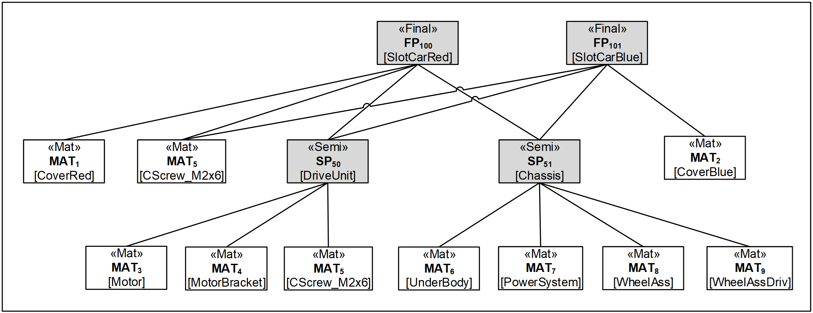
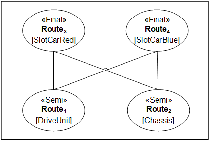
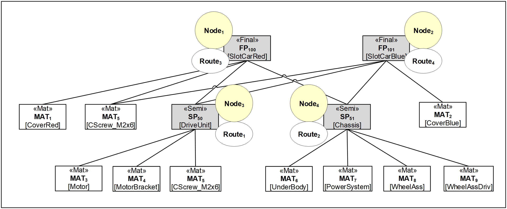

\newpage

```{r setup, include=FALSE, warning=FALSE}
knitr::opts_chunk$set(echo = TRUE)
knitr::opts_chunk$set(fig.pos = 'H') #  ensuring that figures stay at their original place
#knitr::opts_chunk$set(warning = FALSE, message = FALSE)
```

--------------------------------------------------------------------------------

# Loading: Libraries, ERP Data and Accounting Logic

## Loading Libraries (Dependencies)

```{r message=FALSE, warning=FALSE}
library(tidyverse)
```

---

```{r out.width="100%", fig.align='center', fig.cap = "SlotCar's BOM"}

```

---

```{r out.width="40%", fig.align='center', fig.cap = "SlotCar's ROUTING"}

```

---

```{r out.width="100%", fig.align='center', fig.cap = "SlotCar's MIS"}

```

---

## Loading Data from ERP System

```{r}
load("SlotCar.RData")
```

---

```{r}
ls()
```

---

## Loading Cost \& GHG Accounting Logic

```{r}
source("01_item_master_builder.R")
source("02_erp_mapper.R")
source("03_mis_graph_builder.R")
source("04_ais_recursion_engine.R")
source("05_ais_analyzer.R")
```

---

# ERP-System Data Delivery: Viewing Data

```{r}
MAT.erp
```

---

```{r}
SEMI.erp
```

---

```{r}
FINAL.erp
```

---

```{r}
BOM.erp # flat BOM construction (i.e. w/o list columns)
```

---

```{r}
ROUTING.erp # flat ROUTING construction  (i.e. w/o list columns)
```

---

```{r}
ACTY.erp
```

---

```{r}
EQIP.erp
```

---

```{r}
ENERGY.erp
```

# Item Master: Building ITEM.tbl

## Building ITEM.tbl

Building *ITEM.tbl* using *buildItemMaster()* 

```{r}
ITEM.tbl <- buildItemMaster(MAT.erp, SEMI.erp, FINAL.erp)
```

---

## Viewing ITEM.tbl

Viewing *ITEM.tbl*

```{r}
ITEM.tbl
```

---

# Item Mapper: Mapping ERP to ITEM

## Building BOM.tbl, ROUTING.tbl and MAT.tbl

Mapping *BOM.erp*, *ROUTING.erp* and *MAT.erp* to *ITEM.tbl* using *mapERPtoITEM()* 

```{r}
mapERPtoITEM(ITEM.tbl, BOM.erp, ROUTING.erp, MAT.erp)
```

---

## Viewing BOM.tbl, ROUTING.tbl and MAT.tbl

Viewing *BOM.tbl*

```{r}
BOM.tbl
```

---

Viewing *ROUTING.tbl*

```{r}
ROUTING.tbl
```

---

Viewing *MAT.tbl*

```{r}
MAT.tbl
```

---

# MIS Graph (Digital Twin) Engine: Building MIS.tbl

## Building MIS.tbl

Building *MIS.tbl* using *buildMIS()* 

```{r}
MIS.tbl <- buildMIS(ITEM.tbl, ROUTING.tbl, ACTY.erp, BOM.tbl, EQIP.erp, ENERGY.erp)
MIS.tbl <- MIS.tbl |> select(nodeID, chilNodeIDs, routeID:matList)
```

---

## Viewing MIS.tbl

Viewing *MIS.tbl*

```{r}
MIS.tbl |> select(nodeID, chilNodeIDs, itemID, itemName, actyName, eqipList, matList)
```

---

# AIS Recursion Engine: Building AIS.tbl

## Calculating AIS.tbl

Calculating *AIS.tbl* using *buildMultiItemAccData()*

```{r}
# nodeIDs = c(1:4)
AIS.tbl <- buildMultiItemAccData(c(1:4), MIS.tbl, ITEM.tbl, MAT.tbl)
```

---

## Viewing AIS.tbl

Viewing *AIS.tbl*

```{r}
AIS.tbl |> select(nodeID, PC, PCF) |>
  knitr::kable(caption = "PC and PCF of (semi-)finished products")
```

---

```{r}
AIS.tbl
```

---

```{r}
AIS.tbl |> select(nodeID, nodeTotalsList) |> knitr::kable()
```

---

```{r}
AIS.tbl$nodeTotalsList[[1]]
```

---

# AIS Data Analysis: Comparison of Cost & GHG Structures 

## Building Comparison.tbl

Building *Comparison.tbl* using *buildMultiItemCatShareData()*

```{r}
# nodeID = c(1,2)
Comparison.tbl <- buildMultiItemCatShareData(c(1,2), AIS.tbl)
```

---

## Viewing Comparison.tbl

Viewing *Comparison.tbl*

```{r}
Comparison.tbl |> knitr::kable(caption = "Comparative analysis of PC and PCF structures")
```

---

## Plotting Comparison.tbl

Plotting *Comparison.tbl* using *plotMultiItemCatSharesData()*

```{r out.width="70%", fig.align='center'}
plotMultiItemCatSharesData(Comparison.tbl)
```

---

\newpage

# Appendix

## A Real‑Factory Narrative: The Slot-Car Assembly Plant

*Prompt/MS-Copilot*: Give a narrative description of the real factory case for producing
slot-cars that gives a compact overview concering cost and GHG emission accounting.

*Answer/MS-Copilot*: In a mid‑sized manufacturing town, a factory produces a popular line of compact slot-cars. The product is simple enough to be made at scale, yet complex enough to involve multiple materials, machining steps, and assembly operations. To meet both cost and sustainability goals, the factory introduced an **activity-based cost & GHG accounting system**. Every material, activity, and equipment categorey is assigned:

-   a **unit cost** (EUR/kg, EUR/h, EUR/kWh)

-   a **GHG emission factor** (kgCO2e/kg, kgCO2e/h, kgCO2e/kWh)

-   a **routing definition** describing how much labor, machine time, and energy
    each production step consumes.

This data feeds into a product‑level breakdown that reveals:

-   **direct costs** (materials)

-   **indirect costs** (labor + equipment)

-   **Scope 1 emissions** (direct combustion)

-   **Scope 2 emissions** (electricity)

-   **Scope 3 emissions** (materials + equipment embodied emissions).

With this transparency, engineers can pinpoint improvement opportunities -
lighter aluminum tubes, lower‑energy welding settings, or more efficient
painting cycles - while managers can evaluate the financial impact of design
changes or supplier choices.

In short, the factory is a realistic example of why modern manufacturing increasingly relies on **activity-based cost & GHG accounting system**: it enables better decisions, supports regulatory compliance, and strengthens competitiveness in a market where customers care about both price and
environmental performance.

---

## From BOM and ROUTING To MIS: Explaining Details

*Question/MS-Copilot*: Explain which data are provided by the ERP system, why is there a need for a unified Item master (ITEM.tbl) and how is the unified item master needed for building the MIS graph engine for providing the digital twin of the production system, the recursive engine for calculating the products cost and GHG emissions and the breakdown engine for delivering detailed reports concerning the different cost and GHG scope categories.

---

*Answer/MS-Copilot*: Below is a **clear, compact, and conceptually precise explanation** of:

- **what data the ERP system provides**,  
- **why a unified Item Master (ITEM.tbl) is necessary**, and  
- **how this unified Item Master enables**  
  - the **MIS graph engine**,  
  - the **recursive cost & GHG engine**, and  
  - the **breakdown engine**  
in the flashlight production digital twin.

I’ll keep it structured and slide‑ready, but still rich enough for academic or technical documentation.

---

### What Data the ERP System Provides

In the flashlight factory, the ERP system supplies **three essential data domains**:

**(A) BOM Data (Bill of Materials)**  
This includes:

- which **materials** and **semi‑finished items** are required  
- in what **quantities**  
- for producing which **target item**

This is the **material‑input knowledge**.

---

**(B) ROUTING Data (Process Plan)**  
This includes:

- which **activity** produces each item  
- required **labor time**, **machine time**, **energy use**  
- which **equipment** is used  
- process‑specific **cost** and **emission factors**

This is the **transformation‑knowledge**.

---

**(C) Master Data (Materials, Activities, Equipment)**  
This includes:

- material prices and emission factors  
- activity cost rates (labor, overhead)  
- equipment cost rates and embodied emissions  
- electricity related emission factors (Scope 2)  
- direct combustion emissions factors (Scope 1)

This is the **valuation knowledge**.

---

### Why a Unified Item Master (ITEM.tbl) Is Needed

ERP systems typically store BOM and ROUTING in **separate tables**, often with:

- different ID systems,  
- different naming conventions,  
- different levels of granularity,  
- and no guaranteed one‑to‑one mapping.

This creates three problems:

---

**(A) BOM and ROUTING refer to items differently**  
BOM may refer to:

- “CoverRed”  
- “Underbody”  
- “Chassis”

Routing may refer to:

- “Item 4711”  
- “Item 4711‑A”  
- “Assembly A”

Without a unified ID, the system cannot know that:

**the BOM input “Chassis” is the same entity that the ROUTING says is produced by assembly.**

---

**(B) Items appear in multiple roles**  
The same item may be:

- a **material** in one context,  
- a **semi‑finished item** in another,  
- a **final product** in a third.

Only a unified Item Master can assign:

- a **single unique ID**,  
- a **consistent category**,  
- a **consistent set of attributes**,  
to each item.

---

**(C) The MIS graph requires a single ontology**  
The MIS graph is a **network of hybrid nodes**.  
Each hybrid node must contain:

- **item knowledge** (from BOM + master data)  
- **activity knowledge** (from routing + master data)

This is impossible unless both BOM and ROUTING refer to the **same item IDs**.

Thus, the unified Item Master is the **semantic backbone** of the entire digital twin.

---

### How the Unified Item Master Enables the MIS Graph Engine

The MIS graph engine builds a **directed transformation graph** where each node is a **hybrid production entity**:

- **v.item** = the produced object  
- **v.activity** = the transformation that produces it  

To construct this graph, the engine must:

1. **Match BOM inputs** to  
2. **The activity that produces the target item**  
3. **Using the same item ID**

Without ITEM.tbl, this matching is impossible.

**The unified Item Master enables:**

- consistent node creation  
- consistent edge creation  
- consistent attribute assignment  
- consistent traversal logic  

It is the **ontology** that makes the graph computable.

---

### How the Unified Item Master Enables the Recursive Engine

The recursive engine computes:

- **Cost(v)**  
- **GHG(v)**  

for every hybrid node **v**, by walking from the leaf nodes upstream through the MIS graph.

This requires:

- consistent item IDs  
- consistent activity IDs  
- consistent quantities  
- consistent cost/emission attributes  

If BOM and ROUTING refer to items differently, recursion breaks.

**The unified Item Master ensures:**

- every upstream dependency is correctly identified  
- every material and activity contribution is aggregated  
- Scope 1, 2, and 3 emissions are correctly assigned  
- equipment and energy contributions are not lost  

Thus, ITEM.tbl is the **key enabler** of recursive cost and GHG propagation.

---

### How the Unified Item Master Enables the Accounting Recursion Engine

The accounting engine produces:

- direct material cost  
- indirect activity cost  
- indirect equipment cost as well as  
- Scope 1 / Scope 2 / Scope 3 emissions 

To do this, it must:

- trace each contribution back to the correct item  
- trace each activity back to the correct node  
- aggregate partial costs and GHG emissions by category

This requires:

- a **single item ID** for grouping  
- a **single activity ID** for grouping  
- consistent mapping between BOM and routing  

Without ITEM.tbl, cost and GHG accounting would be:

- incomplete,  
- inconsistent,  
- or impossible.

---

### In One Sentence

The ERP system provides the raw material, process, and valuation data, but only the unified Item Master (ITEM.tbl) makes it possible to integrate BOM and ROUTING into a coherent MIS graph, enabling the digital twin, the recursive accounting engine, and the cost analysis engine to function correctly and consistently.

---

## Manual Building of Input Data from ERP System

```{r eval=FALSE}
# Building input data by hand

MAT.erp <- tribble(
  ~matID, ~matName,                ~pM,   ~uMEL,
  1,      "CoverRed",              29.00,   0.15,   
  2,      "CoverBlue",             28.00,   0.10,
  3,      "Motor",                 10.00,   0.20,
  4,      "MotorMountingBracket",   0.12,   0.0006,
  5,      "CScrew_M2x6",            0.02,   0.05,
  6,      "UnderBody",              1.44,   0.0072,
  7,      "PowerSystem",            3.26,   0.06,
  8,      "WheelAssembly",         13.40,   0.766,
  9,      "WheelAssemblyDriven",   18.20,   1.10)
	
SEMI.erp <- tribble(
  ~spID, ~spName,
  50,    "DriveUnit",
  51,    "Chassis")

FINAL.erp <- tribble(
  ~fpID, ~fpName,
  100,    "SlotCarRed",
  101,    "SlotCarBlue")

BOM.erp <- tribble(
  ~bomID, ~parCat, ~parID, ~childCat, ~childID, ~rM,
  1,      "semi",   50,     "mat",      3,        1,
  2,      "semi",   50,     "mat",      4,        1,
  3,      "semi",   50,     "mat",      5,        1,
  4,      "semi",   51,     "mat",      6,        1,
  5,      "semi",   51,     "mat",      7,        1,
  6,      "semi",   51,     "mat",      8,        1,
  7,      "semi",   51,     "mat",      9,        1,
  8,      "final",  100,     "mat",      1,        1,
  9,      "final",  100,     "mat",      5,        1,
 10,      "final",  100,     "semi",    50,        1,
 11,      "final",  100,     "semi",    51,        1,
 12,      "final",  101,     "mat",      2,        1,
 13,      "final",  101,     "mat",      5,        1,
 14,      "final",  101,     "semi",    50,        1,
 15,      "final",  101,     "semi",    51,        1)

ACTY.erp <- tribble(
  ~actyID, ~actyName,             ~pA,
  1,       "DriveUnitAssembly",   2,
  2,       "ChassisAssembly",     2,
  3,       "SlotCarAssembly",     2)

ENERGY.erp <- tribble(
  ~enyID, ~enyName,      ~emE,  ~scopeCat,
  1,      "Electricity", 0.069, 2,
  2,      "Gas",         0.069, 1)

EQIP.erp <- tribble(
  ~eqipID, ~eqipName,            ~qE, ~cuEEL,     ~enyID,
  1,       "AssemblerElectric",  0.3,  0.00312,   1,
  2,       "AssemblerGas",       0.3,  0.00312,   2)

ROUTING.erp <- tribble(
  ~routeID, ~semFinCat, ~semFinID, ~actyID, ~rE,    ~eqipID,    ~powE,
  1,        "semi",      50,        1,       7.5,    2,          0.05,
  2,        "semi",      51,        2,      51.0,    1,          0.05,
  3,        "final",     100,       3,       1.5,    1,          0.05,
  4,        "final",     101,       3,       1.5,    1,          0.05)
```

